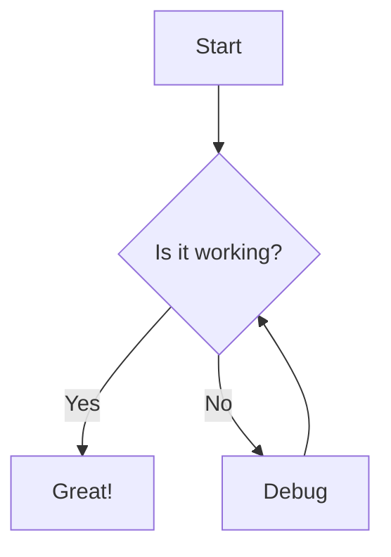
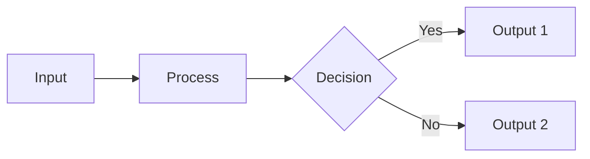
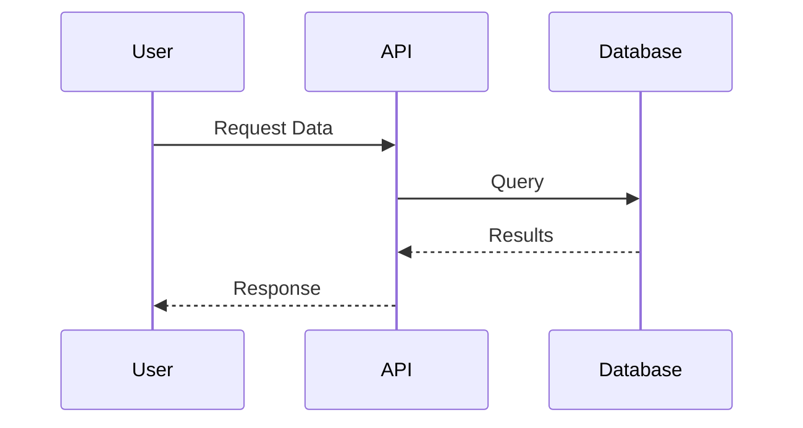
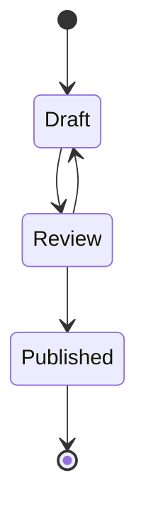
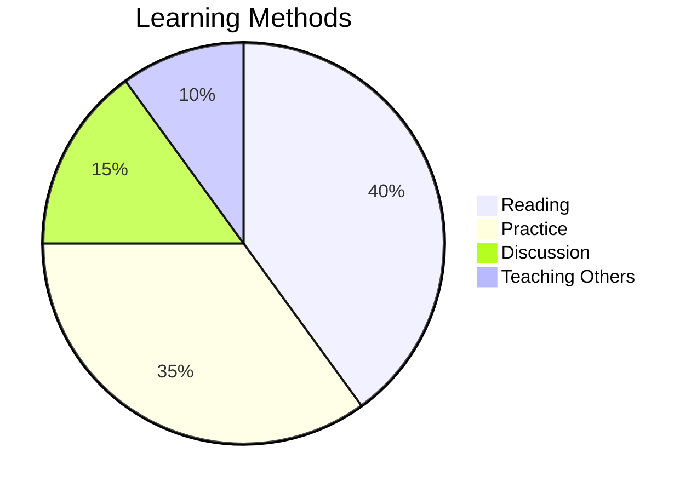
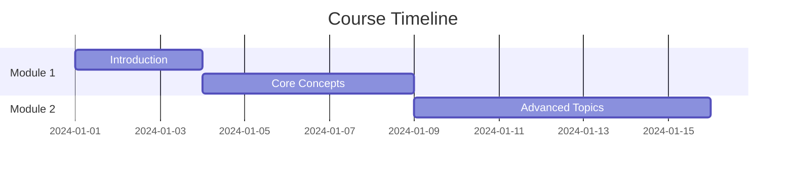
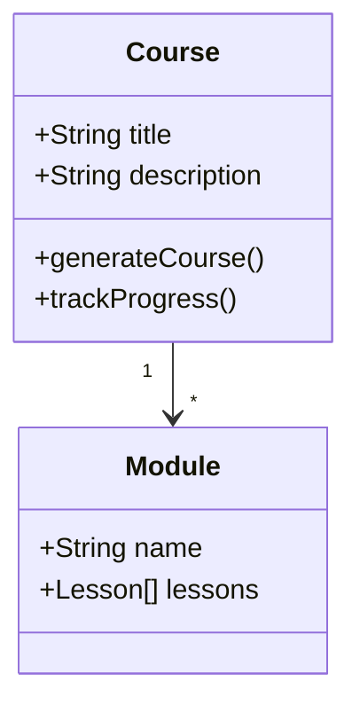

# Mermaid Diagrams in Courses

Your course platform now supports Mermaid.js diagrams! You can embed flowcharts, sequence diagrams, Gantt charts, and more directly in your course content.

## How to Use

Simply wrap your Mermaid diagram code in a code block with the `mermaid` language tag:

````markdown

````

## Example Diagrams

### Flowchart
````markdown

````

### Sequence Diagram
````markdown

````

### State Diagram
````markdown

````

### Pie Chart
````markdown

````

### Gantt Chart
````markdown

````

### Class Diagram
````markdown

````

## Use Cases

1. **Process Flows**: Show step-by-step procedures
2. **System Architecture**: Explain how components interact
3. **Learning Paths**: Visualize decision trees
4. **Project Timelines**: Display course schedules
5. **Relationships**: Show how concepts connect

## Tips

- Keep diagrams simple and focused
- Use clear, descriptive labels
- Choose the right diagram type for your content
- Test your diagram syntax before deploying

## Resources

- [Mermaid.js Official Docs](https://mermaid.js.org/)
- [Mermaid Live Editor](https://mermaid.live/) - Test your diagrams
- [Diagram Syntax Reference](https://mermaid.js.org/intro/)
